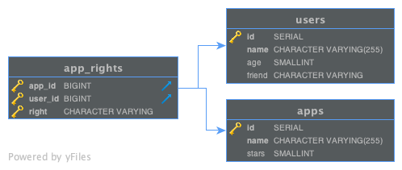

# Run the example

In order to demonstrate the usage of Kelon, we provide an example setup which shows a configuration of kelon with two separate datastores (PostgreSQL & MySQL). To demonstrate the ease of switching between datastores with kelon, both datastores have the same data set.

## Datamodel

The datamodel is fairly simple but contains everything you will need in a more advanced setup (i.e. JOINS).



## Example Dataset

### appstore.users

| id | name     | age   | friend      |
| -- | -------- | ----- | ----------- |
| 1  | Arnold   | 73    | John Connor |
| 2  | Kevin    | 21    | Kevin       |
| 3  | Anyone   | null  | Anyone      |

### appstore.apps

| id | name                     | stars |
| -- | ------------------------ | ----- |
| 2  | First App for everyone   | 1     |
| 2  | Arnold's App             | 2     |
| 3  | Famous App               | 5     |

### appstore.app_rights

| app_id | user_id | right |
| ------ | ------- | ----- |
| 2      | 1       | OWNER |

## Policies

This example project contains four basic policies with should give you a better understanding of how to write policies using Kelon.
If you have a closer look at [datastore.yml](https://github.com/Foundato/kelon/blob/master/examples/config/datastore.yml) & [api.yml](https://github.com/Foundato/kelon/blob/master/examples/config/api.yml) you will notice, that the table's data inside your datastores can be 'magically' accessed inside the OPA-Regos with the following Syntax:

`data.{datastore-alias}.{entity}.{column}`

With this handy feature, we can write following policies:

1. Users with right 'OWNER' on app can access it always
    * Path: GET /api/{datastore-alias}/apps/:app_id
2. All apps with 5 stars are public
    * Path: GET /api/{datastore-alias}/apps/:app_id
3. The first app is public
    * Path: GET /api/{datastore-alias}/apps/:app_id
4. All users that are a friends of Kevin are allowed see everything
    * Path: GET /api/{datastore-alias}/*

## Start the environment

The entire example environment can be started with the provided docker-compose in the project's root directory with following command

```bash
$ docker-compose up -d
```

This will start following components:

* Kelon
    * Port: 8181
* MySQL
    * Port: 3306
* PostgreSQL
    * Port: 5432
* Adminer
    * Port: 8080

After all containers are built and up, you can verify that everything is up by performing a valid request:

to PostgreSQL
```bash
$ curl --request POST \
  --url http://localhost:8181/v1/data \
  --header 'Content-Type: application/json' \
  --data '{"input": {"method": "GET", "path": "/api/pg/apps/2", "user": "Arnold"}}'

> {"result":true}
```

to MySQL
```bash
$ curl --request POST \
  --url http://localhost:8181/v1/data \
  --header 'Content-Type: application/json' \
  --data '{"input": {"method": "GET", "path": "/api/mysql/apps/2", "user": "Arnold"}}'

> {"result":true}
```

## Play around

You now have a complete setup of Kelon which you can use to play around with a little.

You can i.e. try to access an app you shouldn't be allowed to:
```bash
$ curl --request POST \
  --url http://localhost:8181/v1/data \
  --header 'Content-Type: application/json' \
  --data '{"input": {"method": "GET", "path": "/api/pg/apps/2", "user": "Anyone"}}'

> {"result":false}
```

Or access an app with 5 stars (which the user 'Anyone' is allowed to):
```bash
$ curl --request POST \
  --url http://localhost:8181/v1/data \
  --header 'Content-Type: application/json' \
  --data '{"input": {"method": "GET", "path": "/api/pg/apps/3", "user": "Anyone"}}'

> {"result":true}
```

There is also a POSTMAN-COLLECTION in the example directory which contains a bunch of queries agains all three datasources (PostgreSQL, MySQL, MongoDB).
Feel free to play around with the existing regos and databases to get a feeling of how to write policies and configure Kelon.

## Clean up

After you are done, just stop the entire setup by running:

```bash
$ docker-compose down
```