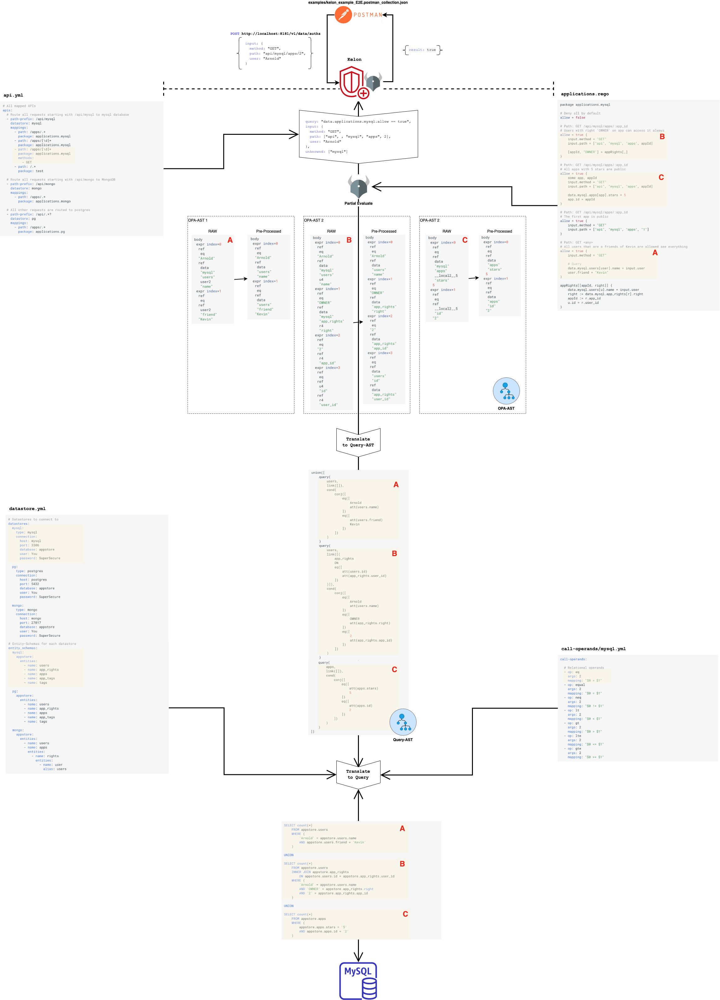

# Deconstructing the example

To become a deep understanding of how Kelon works in action, we now deconstruct the entire internal process of kelon while executing the example setup provided inside the repository. Therefore the following three infographics show three example queries made to Kelon.

## (My)SQL



The example for PostgreSQL is nearly the same (just swap 'mysql' with 'pg').

## And now No-SQL

When we run the example above against the MongoDB, there is also not much difference in each processing step.
Only the generated output are now following native MongoDB-Query:

```js
users.find({ 
    "$or": [ 
        {
            "name": "Arnold", 
            "friend": "Kevin"
        } 
    ] 
})

apps.find({ 
    "$or": [ 
        {
            "id": 2, 
            "stars": { 
                "$gt": 2 
            }, 
            "rights.right": "OWNER", 
            "rights.user.name": "Arnold"
        }, 
        {
            "stars": 5, 
            "id": 2
        } 
    ]
})
```