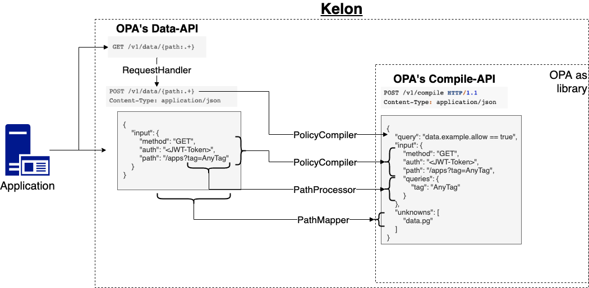

# Request mapping

Each incoming request to the backend has to be intercepted and wrapped in a JSON-object called "input". This object has to contain all important information about the incoming request like 'method', 'path' and i.e. 'authorization'.

Kelon takes the input-object, adds more information to it and compiles it with the Open Policy Agent.
This means you also have access to i.e. Query-Parameters a client sent to your backend inside your Regos!